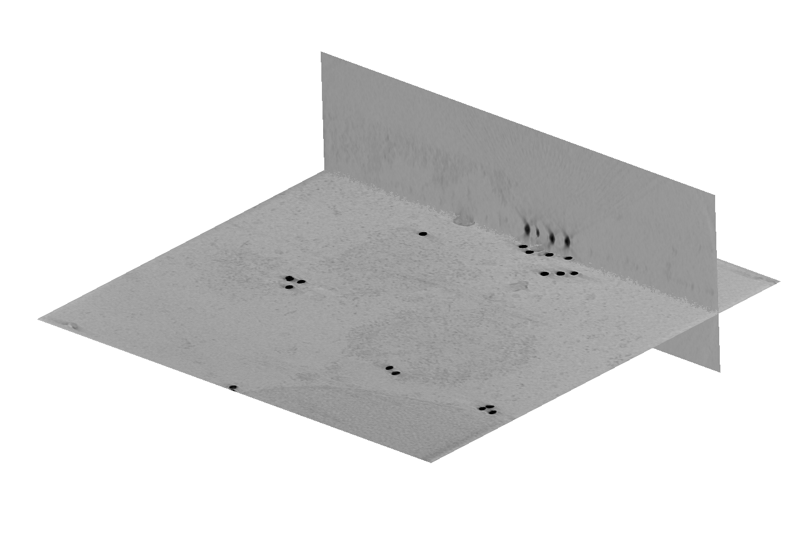

# tttsa

[](https://github.com/McHaillet/tttsa/raw/main/LICENSE)
[](https://pypi.org/project/tttsa)
[](https://python.org)
[](https://github.com/McHaillet/tttsa/actions/workflows/ci.yml)
[](https://codecov.io/gh/McHaillet/tttsa)

Automated tilt-series alignment for cryo-ET using teamtomo-torch!

<p align="center">
  
</p>

The implementation follows the algorithm in the AreTomo paper: https://www.sciencedirect.com/science/article/pii/S2590152422000095

## Installation

```bash
pip install tttsa
```

## Example

The program is currently not optimal in memory usage, so it's advised to run with 
an 8x downsampled (binned) tilt-series.

```python
import torch
from cryotypes.projectionmodel import ProjectionModel
from cryotypes.projectionmodel import ProjectionModelDataLabels as PMDL
from tttsa import tilt_series_alignment
from tttsa.back_projection import filtered_back_projection_3d

tilt_angles = list(range(-51, 54, 3))
n_tilts = len(tilt_angles)
# this angle is assumed to be a clockwise forward rotation after projecting the sample
tilt_axis_angle_prior = -88.7
alignment_pixel_size = 10  # in A
# calculate sample thickness in pixels, 1600 A (160nm) thick ice layer
# like in AreTomo this parameter is very critical for alignment quality
align_z = int(1600 / alignment_pixel_size)
recon_z = int(2400 / alignment_pixel_size)
weighting = "hamming"  # weighting scheme for filtered back projection
device = "cuda" if torch.cuda.is_available() else "cpu"

# create a mock tilt-series
size = 400
tilt_series = torch.rand((n_tilts, size, size))

# Initialize the projection-model prior
projection_model_prior = ProjectionModel(
    {
        PMDL.ROTATION_Z: tilt_axis_angle_prior,
        PMDL.ROTATION_Y: tilt_angles,
        PMDL.ROTATION_X: 0.0,
        PMDL.SHIFT_X: 0.0,
        PMDL.SHIFT_Y: 0.0,
        PMDL.EXPERIMENT_ID: 'position_1',
        PMDL.PIXEL_SPACING: alignment_pixel_size,
        PMDL.SOURCE: 'position_1.st',
    }
)

projection_model_optimized = tilt_series_alignment(
    tilt_series.to(device),
    projection_model_prior,
    align_z,
    find_tilt_angle_offset=True,
)

final = filtered_back_projection_3d(
    tilt_series,
    (recon_z, size, size),
    projection_model_optimized,
    weighting=weighting,
)
```

## Give it a whirl?

This will run the example (after downloading and installing the repository):

```
cd examples
python usage.py
```

It will take some time to initially download the data from Zenodo. The reconstruction is stored in examples
`/data/tomo2000528_107.mrc`.

